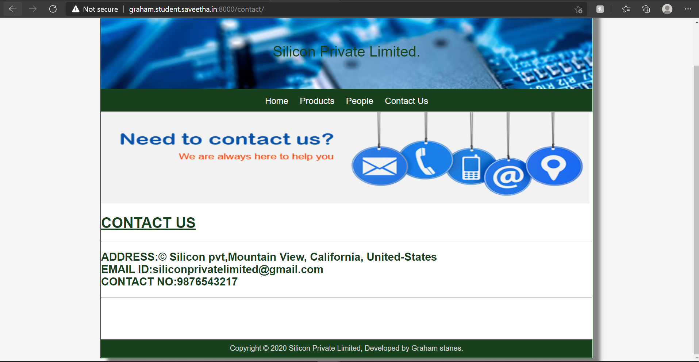

# Web Design for a Manufacturing Company
## AIM: 
To design a static website for a chip manufacturing company.

## DESIGN STEPS:
### Step 1: 
Requirement collection.
### Step 2:
Creating the layout using HTML and CSS.
### Step 3:
Updating the sample content.
### Step 4:
Choose the appropriate style and color scheme.
### Step 5:
Validate the layout in various browsers.
### Step 6:
Validate the HTML code.
### Step 6:
Publish the website in the given URL.

## PROGRAM:

### base.html
```

<!DOCTYPE html>
<html lang="en">

<head>
    <title>Silicon Private Limited</title>
    <link rel="stylesheet" href="">
    <link rel = "icon" href ="" type = "image/x-icon"> 
              
</head>

<body>
    <div class="container">
    <div class="banner">
        Silicon Private Limited.
    </div>
    <div class="menu">
        <div class="menuitem"><a href="/home">Home</a></div> 
        <div class="menuitem"><a href="/products">Products</a></div> 
        <div class="menuitem"><a href="/people">People</a></div>
        <div class="menuitem"><a href="/contact">Contact Us</a></div> 
    </div><div class="content">
        
    
    </div>
    <div class="footer">
        Copyright © 2020 Silicon Private Limited, Developed by Graham stanes.
    </div>
    </div>
</body>

</html>
```

### home.html
```



    <div class="homecontent">    
    <h1>About Us</h1>
    
    <div class="contenttext">
    Silicon Pvt Ltd, provides a broad range of semiconductor and infrastructure software applications that serve the data center, networking, software, broadband, wireless, and storage and industrial markets. Common applications for its products include: data center networking, home connectivity, broadband access, telecommunications equipment, smartphones, base stations, data center servers and storage, factory automation, power generation and alternative energy systems, displays, and mainframe operations and management, and application software development. Some of Silicon's core technologies and products include:
    <ul>
        <li>Memory Chips</li>
        <li>SATA HDD</li>
        <li>SATA SSD </li>
        <li>Broadband Modems</li>
        <li>Wifi Devices</li>
        <li>Switching Devices</li>
        <li>Optical Sensors</li>
    </ul> 
    </div>
    </div>

```

### products.html
```



    <div class="productcontent">    
    <h1 style="text-align: center;">
        <strong>Our Premium Products</strong>
    </h1>
    <br>
    <br>
    <br>
    <br>
    <div class="productitems">
        <div class="productitem"> 
            <div class="itemimage">
                <a href="https://www.amazon.in/DATA-Premier-2666Mhz-A1Price-A1Products/dp/B07GRFYM22/">
            
            </a>
            </div>
           <div class="itemname"><b>4GB DDRA4 laptop memory</b></div>
           <div class="itemprice"><b>Price: Rs.1698.00</b> </div>
           <br>
        </div>
        <div class="productitem"> 
            <div class="itemimage">
                <a href="https://www.amazon.in/Western-Digital-WD10EZEX-Desktop-7200rpm/dp/B0711YN12S/">
            
            </a>
            </div>
         <div class="itemname"><b>Western Digital HDD WD10EZEX 1TB SATA 6Gb/s Desktop 7200rpm 64MB Cache Bare Drive</b></div>
            <div class="itemprice"><b>Price: Rs.3559.00 </b></div>
        </div>
        <div class="productitem">
            <div class="itemimage">
                <a href="https://www.amazon.in/MSRKart-OPTICAL-LIQUID-LEVEL-SENSOR/dp/B08KF4P9DZ/">
            
            </a>
            </div>
           <div class="itemname"><b>Optical liquid level sensor</b></div>
           <div class="itemprice"><b>Price: Rs.2395.00</b></div>
        </div>
        <hr/>
        <br/>
        <br/>
        <div class="productitem">
            <div class="itemimage">
                <a href="https://www.amazon.in/Crucial-BX500-240GB-2-5-inch-CT240BX500SSD1/dp/B07G3YNLJB/">
            
            </a>
            </div>
          <div class="itemname"><b>SATA HDD DRIVE</b></div>
          <div class="itemprice"><b>Price: Rs.2500.00</b></div>
        </div>
        <div class="productitem">
            <div class="itemimage"><a href="https://www.amazon.in/SanDisk-Class-Memory-Adapter-SDSQUAR-032G-GN6MA/dp/B073JWXGNT/">
            
            </a>
            </div>
          <div class="itemname"><b>SanDisk 32GB Class 10 Micro SDHC Memory Card with Adapter (SDSQUAR-032G-GN6MA)</b></div>
         <div class="itemprice"><b>Price: Rs.399.00</b></div>
        </div>
        <div class="productitem">
            <div class="itemimage">
                <a href="https://www.amazon.in/JAIN-AUTOMATION-Inductive-Proximity-Sensor/dp/B07RBF2JRS/">
            
            </a>
            </div>
           <div class="itemname"><b>Proximity sensor</b></div>
          <div class="itemprice"><b>Price: Rs.280</b></div>
        </div>
        <hr/>
        <br/>
        <br/>
        <div class="productitem">
            <div class="itemimage">
                <a href="https://www.amazon.in/Helea-Appliances-Compatible-Google-Assistant/dp/B07XTF8HPP/">
            
            </a>
            </div>
          <div class="itemname"><b>Helea 10A Wi-Fi Smart Plug, for Low Power Appliances (Type D) Compatible with Alexa & Google Assistant</b></div>
          <div class="itemprice"><b>Price : Rs.899.00</b></div>
        </div>
        <div class="productitem">
            <div class="itemimage"><a href="https://www.amazon.in/Robodo-Electronics-MO49-Measuring-Counter/dp/B0787HRQ27">
            
            </a>
            </div>
          <div class="itemname"><b>Robodo MO49 Speed Measuring Sensor Counter Motor Test Groove Coupler Module for Arduino</b></div>
          <div class="itemprice"><b>Price : Rs.204.00</b></div>
        </div>
        <div class="productitem">
            <div class="itemimage"><a href="https://www.amazon.in/Western-Digital-WDS240G2G0A-240GB-Internal/dp/B076Y374ZH/">
            
            </a>
            </div>
           <div class="itemname"><b>Western Digital WD Green 240 GB 2.5 inch SATA III Internal Solid State Drive (WDS240G2G0A)</b> </div>
           <div class="itemprice"><b>Price : Rs.2524.00</b></div>
        </div>
        <hr/>
        <br/>
        <br/>
        <div class="productitem">
            <div class="itemimage"><a href="https://www.amazon.in/ASUS-ZenWiFi-AX-XT8-BLACK/dp/B084CGXVMZ/">
            
            </a>
            </div>
          <div class="itemname"><b>ASUS ZenWiFi</b></div>
          <div class="itemprice"><b>Price : Rs.48490.00</b></div>
        </div>
        <div class="productitem">
            <div class="itemimage"><a href="https://www.amazon.in/D-Link-DIR-819-Wireless-AC750-Router/dp/B07SBTGP16/ref=sr_1_1?dchild=1&keywords=D-link+Dir-819+750+Mbps+Router&qid=1610277157&sr=8-1">
            
            </a>
            </div>
           <div class="itemname"><b>D-link Dir-819 750 Mbps Router</b></div>
          <div class="itemprice"><b>Price : Rs.1,399.00</b></div>
        </div>
        <div class="productitem">
            <div class="itemimage"><a href="https://www.amazon.in/2-5-inch-Internal-Solid-State-WDS100T2B0A/dp/B073SBQMCX/">
            
            </a>
            </div>
           <div class="itemname"><b>Western Digital Blue 1TB Internal Solid State Drive</b></div>
           <div class="itemprice"><b>Price :Rs.13,985.00</b></div>
        </div>
    </div>
    </div>

```

### people.html
```



    <h1 id="Ex">Executives</h1>
    <div class="row">
        <div class="column">
            <h2>Bill gates</h2>
            
            <P>Founder</P>
        </div>
        <div class="column">
            <h2>Sundar</h2>
            <div class="img">
            
            </div>
            <p>Chief Executive Officer (CEO)</p>
        </div>
        <div class="column">
            <h2>Emma watson</h2>
            
            <p>Chief Financial Officer (CFO)</p>
        </div>
        <div class="column">
            <h2>Robert Drowney JR</h2>
            
            <p>Chief Operating Office (COO)</p>
        </div>
        <div class="column">
            <h2>Scarlett johanson</h2>
            
            <p>Chief Information Officer (CIO)</p>
        </div>
        <div class="column">
            <h2>Chris evans</h2>
            
            <P>Chief Marketing Officer (CMO)</P>
        </div>
    </div>


```
### contact.html
```



   
    <h1 class="contact">
        <strong><u>CONTACT US</u></strong> 
    </h1>
    <hr>
    <h2 class="contact">
        <strong>ADDRESS:</strong>© Silicon pvt,Mountain View, California, United-States
            <br/>
        <strong>EMAIL ID:</strong>siliconprivatelimited@gmail.com
            <br/>
        <strong>CONTACT NO:</strong>9876543217
    </h2>
    <hr>


```
## OUTPUT:




## CODE VALIDATION REPORT:


## RESULT:
Thus a website is designed for the chip manufacturing company and is hosted in the URL http://graham.student.saveetha.in:8000/. HTML code is validated.